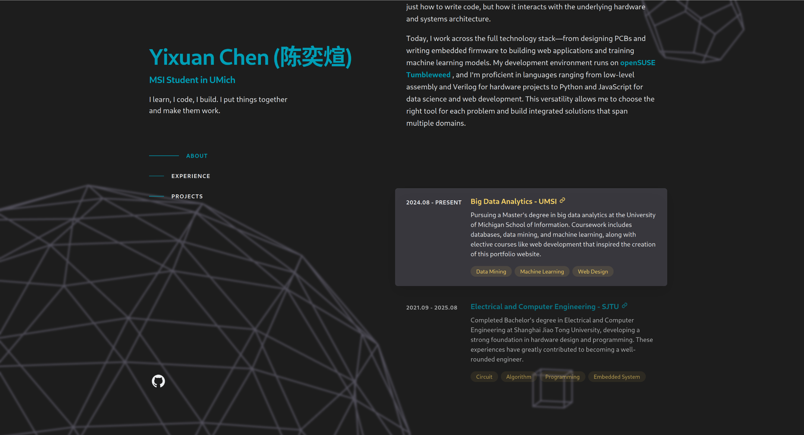

# Interactive Portfolio Website

A modern, responsive portfolio website showcasing professional work and technical skills through an immersive 3D experience.

[](https://coconautty.github.io/)
[](https://github.com/CocoNautty/coconautty.github.io)



## ✨ Features

- **Interactive 3D Background**: Dynamic Three.js scene with animated geometric shapes
- **Smooth Animations**: GSAP-powered transitions and scroll-based animations
- **Modern Design**: Clean, professional layout with responsive SCSS architecture
- **Smart Navigation**: Scroll spy navigation with smooth section transitions
- **Project Showcase**: Comprehensive display of technical projects and skills
- **Performance Optimized**: Fast loading with Vite build system and hot module replacement

## 🚀 Tech Stack

### Frontend
- **React 18** - Modern component-based UI library
- **Vite** - Fast build tool with hot module replacement
- **SCSS** - Advanced styling with modular architecture
- **React Router** - Client-side routing and navigation

### 3D Graphics & Animation
- **Three.js** - 3D graphics and WebGL rendering
- **React Three Fiber** - React renderer for Three.js
- **React Three Drei** - Useful helpers for React Three Fiber
- **GSAP** - Professional-grade animation library

### Development Tools
- **ESLint** - Code quality and consistency
- **GitHub Pages** - Seamless deployment pipeline
- **Sass** - CSS preprocessing with advanced features

## 🛠️ Installation & Setup

### Prerequisites
- Node.js (v16 or higher)
- npm or yarn package manager

### Quick Start

1. **Clone the repository**
   ```bash
   git clone https://github.com/CocoNautty/coconautty.github.io.git
   cd coconautty.github.io
   ```

2. **Install dependencies**
   ```bash
   npm install
   ```

3. **Start development server**
   ```bash
   npm run dev
   ```

4. **Open your browser**
   Navigate to `http://localhost:5173`

### Available Scripts

- `npm run dev` - Start development server with HMR
- `npm run build` - Build for production
- `npm run preview` - Preview production build locally
- `npm run lint` - Run ESLint code analysis
- `npm run deploy` - Deploy to GitHub Pages

## 📁 Project Structure

```
portfolio/
├── src/
│   ├── components/          # React components
│   │   ├── About/          # About section component
│   │   ├── Experience/     # Experience showcase
│   │   ├── Header/         # Navigation header
│   │   ├── Projects/       # Project portfolio
│   │   ├── ThreejsBackground/ # 3D background scene
│   │   └── Containers/     # Layout containers
│   ├── data/               # Content data and configuration
│   ├── hooks/              # Custom React hooks
│   ├── utils/              # Utility functions
│   ├── assets/             # Images and static assets
│   └── styles/             # SCSS stylesheets
├── public/                 # Static public assets
└── dist/                   # Production build output
```

## 🎨 Key Components

### Interactive 3D Background
- Real-time rendered geometric shapes
- Smooth camera movements based on scroll position
- Performance-optimized rendering with adaptive frame rates
- Custom geometry utilities and material systems

### Responsive Design
- Mobile-first approach with breakpoint system
- Flexible grid layouts and container queries
- Optimized typography and spacing scales
- Cross-browser compatibility

### Animation System
- Scroll-triggered animations with GSAP
- Smooth page transitions
- Interactive hover effects
- Performance-optimized animation loops

## 🚀 Deployment

The site is automatically deployed to GitHub Pages using the deployment workflow:

```bash
npm run deploy
```

This builds the project and pushes the `dist` folder to the `gh-pages` branch.

## 🤝 Contributing

This is a personal portfolio project, but suggestions and feedback are welcome! Feel free to:

- Open an issue for bug reports or feature suggestions
- Fork the repository to experiment with your own modifications
- Share ideas for improving the user experience

## 📄 License

This project is open source and available under the [MIT License](LICENSE).

## 🔗 Connect

- **Portfolio**: [coconautty.github.io](https://coconautty.github.io/)
- **GitHub**: [@CocoNautty](https://github.com/CocoNautty)

---

Built with ❤️ using React, Three.js, and modern web technologies.